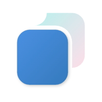

<div align="center">

<h1 align="center" style="margin-top: 0">RustSyncCV-Client</h1>
<p align="center">
<strong>Multi-device clipboard</strong>
</p>

[快速开始](#How-to-use)
|
[参与开发](https://github.com/Dr1mH4X/RustSyncCV-Client/blob/main/doc/dev/development.md)

[](github.com/Dr1mH4X/RustSyncCV-Client)

[](https://github.com/Dr1mH4X/RustSyncCV-Client/releases/latest)


</div>

## How to use

MacOS:
```
xattr -rd com.apple.quarantine /Applications/RustSyncCV.app
```

## ❤️

<a href="https://github.com/RustSync/RustSyncCV-Client/graphs/contributors">
  
</a>

## Dependencies

* [window-vibrancy](https://github.com/tauri-apps/window-vibrancy)

## License

[MIT](https://github.com/Dr1mH4X/RustSyncCV-Client/blob/main/LICENSE)
